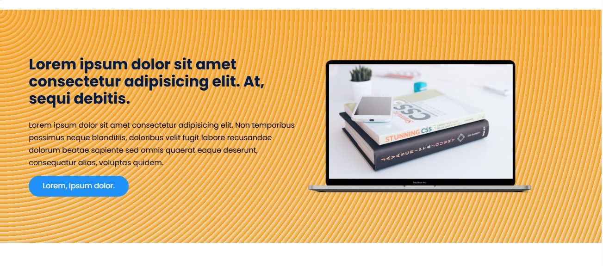
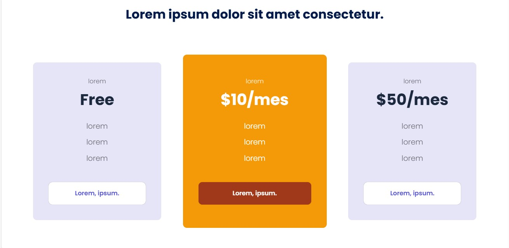
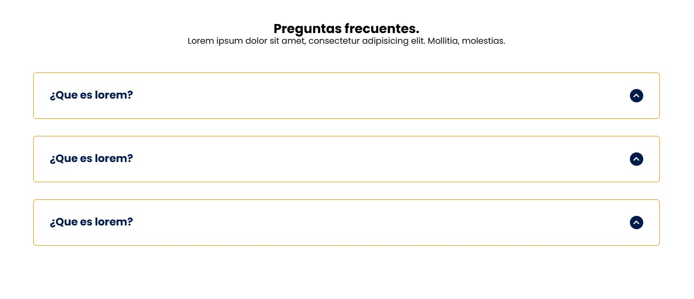

# PaginaWeb Marketing

## Descripción

Este es un prototipo de página web estática diseñado para fines de marketing. La página incluye secciones como "Inicio", "Acerca de", "Contacto", "Blog", "Testimonios" y "Precios". Utiliza HTML, CSS y JavaScript para ofrecer una experiencia de usuario atractiva y funcional.

## Contenido

- **Inicio**: Presentación del producto/servicio y llamado a la acción.

- **Acerca de**: Información sobre la empresa o el equipo.

- **Precios**: Detalles sobre las tarifas y paquetes disponibles.

- **Testimonios**: Opiniones de clientes satisfechos.

- **Preguntas Frecuentes**: Detalles sobre las preguntas mas comunes sobre el producto.

- **Contacto**: Formulario para que los usuarios se pongan en contacto.


## Tecnologías Usadas

- HTML
- CSS
- JavaScript

##Uso
Puedes explorar las diferentes secciones de la página utilizando el menú de navegación. Los testimonios y la sección de precios ofrecen información adicional para usuarios potenciales.

## Instalación

1. Clona el repositorio:
   ```bash
   git clone https://github.com/tu_usuario/pagina-web-.git
2. Navega a la carpeta del proyecto:
 ```bash
cd nombre_del_proyecto
3. Abre el archivo index.html en tu navegador web para ver la página.
